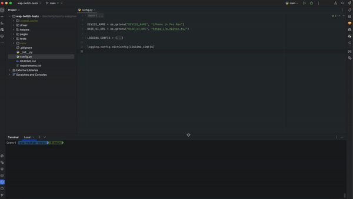

# UI tests for Twitch mobile version

# Demo

# Usage

## Docker execution

TBD

## Local Development environment

### Requirements

1. Install Python 3.10+
1. Chrome browser installed

### Tests execution

1. Create virtualenv in the project folder: `virtualenv venv`
1. Install dependencies: `pip install -r requirements.txt`
1. Activate virtualenv:
    - Unix: `source venv/bin/activate`
    - Windows: `.\venv\Scripts\activate`
1. Run tests: `pytest -v -s`

### What else can be improved
1. .env usage
1. Logs
1. Dockerfile configuration
1. Tests execution command (e.g. using bash)
1. Test data arrangement
1. Non *unix support
1. Parallel support
1. poetry usage instead of pip
1. linting 